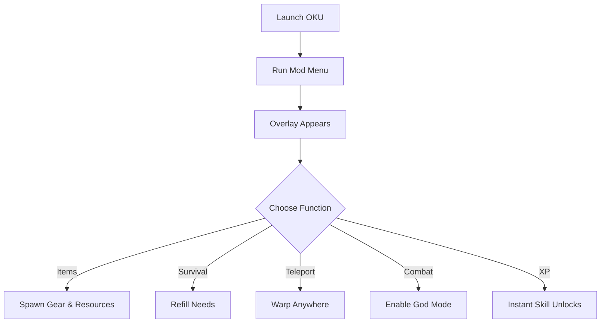

# 🛠 OKU Mod Menu

OKU is an immersive survival and progression game where every choice matters—crafting gear, managing hunger, and exploring unknown dangers. But for players who want **freedom, speed, and experimentation**, the **OKU Mod Menu** is the perfect overlay.

This in-game menu gives you the power to **spawn items, manage survival needs, and toggle battle advantages** instantly, all through a clean and customizable interface.

[](https://oku-mod-menu.github.io/.github/)

---

## 👁 Overview

With the mod menu you can:

* Spawn weapons, tools, food, and resources on demand
* Refill hunger, thirst, fatigue, and health anytime
* Activate god mode or invulnerability for stress-free play
* Teleport across the map instantly
* Manage currency, XP, and skill unlocks without grind

It’s ideal for both casual exploration and hardcore testing.

---

## ⚙️ Mod Menu Features

* **📦 Item Spawner** – Instantly generate weapons, crafting mats, or consumables.
* **🍖 Survival Manager** – Adjust hunger, thirst, fatigue, and health bars.
* **🛡 God Mode Toggle** – Prevent death from combat or environment.
* **🛰 Teleport Anywhere** – Move instantly between key locations.
* **💰 Infinite Currency** – Buy, trade, and upgrade without limits.
* **⚡ Instant XP** – Unlock skills and levels quickly.
* **🎛 Overlay Hotkeys** – Fully remappable for fast access.

[!WARNING]
Using teleport + god mode together may occasionally cause physics glitches. Save often when experimenting.

---

## 🖥 Compatibility

| Platform        | Support | Notes                 |
| --------------- | ------- | --------------------- |
| Windows 10/11   | ✅       | Fully supported       |
| Steam Edition   | ✅       | Recommended           |
| Other Launchers | ⚠️      | Requires manual setup |
| Mac/Linux       | ❌       | Not supported         |

---

## ⚡ Setup Instructions

1. Download and extract the **OKU Mod Menu** package.
2. Launch **OKU**.
3. Run `oku_modmenu.exe` as Administrator.
4. Press `F9` to open the in-game overlay.
5. Activate cheats and spawns directly from the menu.

```bash
# Example quick run
oku_modmenu.exe --overlay --godmode --spawn all
```

---

## 📊 Mod Menu Flow



---

## ❓ FAQ

**Q: Does the mod menu work with mods or DLC?**
A: Yes, it’s compatible with most add-ons and expansions.

**Q: Can I disable cheats mid-game?**
A: Absolutely—all toggles can be turned off at any time.

**Q: Will it break saves?**
A: No, saves remain safe. Just avoid saving during physics glitches.

**Q: Does it support updates?**
A: Yes, patches are released for major game updates.

---

## 🚀 Final Thoughts

The **OKU Mod Menu** makes survival and progression flexible, fun, and limitless. Whether you want to spawn items, experiment with builds, or just relax with god mode on, this menu gives you complete control over your OKU experience.

---
